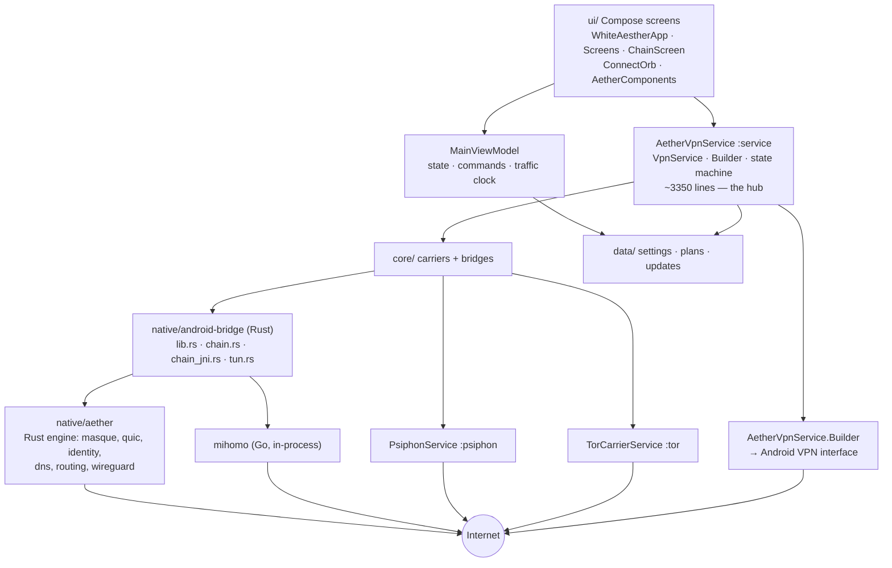

# 00 — Project Map

**Subject:** `WhiteAestherMobile` @ `b55320a` (branch `main`)
**Audited:** 2026-09-30
**Purpose:** orientation for an engineer or agent who has never seen this repository.

This document is the map. Findings live in `02`–`10`, the register in `MASTER-ISSUES.md`,
and the reasoning behind every change in `phases/` and `AI-HANDOFF.md`.

---

## 1. What this project is

An Android client for the **Aether** encrypted-route engine. It finds a working path out of
a restrictive network and carries device traffic through it, either by raising an Android
`VpnService` tunnel or by exposing a loopback SOCKS5 proxy.

Carriers, in the order the user meets them:

| Carrier | What it is | Runs in |
| --- | --- | --- |
| **Aether** (default) | Vendored Rust engine; probes Cloudflare endpoints, completes an authenticated MASQUE handshake over HTTP/3 (QUIC) or HTTP/2 (TLS/TCP) | in-process, via JNI |
| **Psiphon** | `ca.psiphon:psiphontunnel` AAR, Go | separate `:psiphon` process |
| **Tor** | `info.guardianproject:tor-android`, C | separate `:tor` process |
| **WireGuard/WARP** | transport inside the Aether engine | in-process |

An optional **exit chain** (mihomo/Go) adds a second hop after the tunnel so destination
sites see the user's own node rather than Cloudflare.

Nothing phones home. There is no analytics, no telemetry, no account system.

---

## 2. Repository layout

```
.
├── app/                      Android application (Kotlin + Compose)
│   └── src/
│       ├── main/             ~55 production .kt files
│       ├── test/             32 JVM unit-test files  (275 @Test)
│       └── androidTest/      20 instrumentation files (93 @Test)
├── native/
│   ├── android-bridge/       Rust JNI bridge — the only Kotlin↔Rust surface
│   ├── aether/               Vendored Aether engine + quiche (build-time only)
│   ├── chain/                mihomo/FlClash Go: setup.ps1 + build.ps1
│   ├── psiphon/              Bootstrap server-list fetch + Ed25519 verification
│   ├── tor/                  Pluggable transports (lyrebird, snowflake) build
│   ├── third-party/boring-sys  Vendored BoringSSL build glue
│   └── rust-toolchain.toml   Pins Rust 1.98.0 + the three Android targets
├── design/                   Clickable prototype + PORT-STATUS.md
├── docs/                     Release process, device test plan, guides
├── references/               Desktop reference implementation (not built)
├── licenses/                 GPL-3.0.txt, OFL-1.1-Vazirmatn.txt
├── .github/workflows/        ci.yml, release.yml, fdroid-repo.yml
└── app/build.gradle.kts      The build: flavors, ABIs, cargo-ndk task, signing
```

**Not in the repository (generated, git-ignored):**

- `app/src/main/assets/psiphon_server_entries.txt` — fetched by `native/psiphon/setup.ps1`
- `native/chain/third_party/`, `native/chain/build/` — mihomo/FlClash checkout and `.so`
- `native/tor/third_party/`, `native/tor/build/` — transports and executables
- `native/psiphon/third_party/` — tunnel-core checkout used by the verifier

A build missing any of these still installs and runs; the dependent feature reports itself
unavailable rather than failing at connect time. This is deliberate and correct.

---

## 3. Architecture



### Kotlin layer — file responsibility map

Format: `Path → Responsibility → Depends on → Consumed by → Risk`

**Entry points**

| Path | Responsibility | Depends on | Consumed by | Risk |
| --- | --- | --- | --- | --- |
| `WhiteAestherApplication.kt` | Application singleton wiring | DataStore | Android | Low |
| `MainActivity.kt` | Single activity, edge-to-edge, notification permission, update install | ViewModel, `AetherVpnService` | user | Med |
| `MainViewModel.kt` | UI state, commands, diagnostics report, traffic clock | `SettingsRepository`, `AppUpdateManager` | `WhiteAestherApp` | Med |
| `WidgetActionActivity.kt` | Invisible trampoline for widget taps | `AetherVpnService` | widget | Low |

**`service/` — the hub. `AetherVpnService.kt` is ~3350 lines and the single largest class.**

| Path | Responsibility | Risk |
| --- | --- | --- |
| `service/AetherVpnService.kt` | `VpnService`; connection state machine; `Builder`; retries; kill switch; split tunnel; engine driving; carrier orchestration; notification | **High** — most state, concurrency and lifecycle findings live here |
| `service/EngineStatus.kt` | Immutable status + `EngineStatusStore`; the state machine's vocabulary | High (contract) |
| `service/EngineLog.kt` | Bounded in-memory ring (400), `BuildConfig.DEBUG` logcat mirror | Low |
| `service/NetworkIdentity.kt` | Current network key (Wi-Fi/cellular/VPN, dual-SIM aware) | Med |
| `service/CarrierProbe.kt` | Reachability probe over a carried socket | Med |
| `service/PluggableTransport.kt` | Launches Tor bridge transports | Med |
| `service/TrafficMeter.kt` | Byte counters and formatting | Low |
| `service/PsiphonService.kt` | `:psiphon` process, `Messenger` protocol | Med |
| `service/TorCarrierService.kt` | `:tor` process, bootstrap watcher | Med |
| `service/AetherNotification.kt` | Foreground notification + stop action | Med |
| `service/AetherTileService.kt`, `AetherWidgetProvider.kt`, `AetherWidget.kt` | QS tile, home-screen widget | Low |

**`core/` — carriers and bridges**

| Path | Responsibility | Risk |
| --- | --- | --- |
| `core/NativeAetherBridge.kt` | Kotlin side of the Aether JNI contract | High |
| `core/NativeChainBridge.kt` | Kotlin side of the chain (mihomo) JNI contract, TUN fd ownership | High |
| `core/AetherCarrierClient.kt` | Deadline-bounded start budget around the blocking JNI `prepare`/`run` | Med |
| `core/CarrierClient.kt` | Carrier abstraction | Med |
| `core/CarriedSocket.kt` | TLS over a SOCKS-carried socket; **sets `endpointIdentificationAlgorithm`** | Med |
| `core/ChainConfig.kt`, `ChainController.kt` | mihomo YAML generation + lifecycle | Med |
| `core/PsiphonClient.kt`, `TorClient.kt` | `Messenger` binders to the two carrier processes | Low |
| `core/TorConfig.kt`, `TorBridges.kt`, `MoatClient.kt`, `RealityNodes.kt` | torrc render, bridge parsing, Moat, REALITY nodes | Low |
| `core/AppLocale.kt` | Locale + layout direction, SP mirror of the DataStore language | Low |

**`data/` — settings, planning, updates**

| Path | Responsibility | Risk |
| --- | --- | --- |
| `data/SettingsRepository.kt` | Three DataStore stores, the one real migration | Med |
| `data/AppSettings.kt` | The settings model + `toNativeJson()` | Med |
| `data/AutoRoute.kt` | `AutoPlanner`, lane budgets, backoff, `RouteMemory`, `NetworkKey` | Med |
| `data/AppUpdate.kt` | `AppUpdatePolicy` — pure release/verification rules | Med |
| `data/AppUpdateManager.kt` | Download, copy-in, verify, install | Med |
| `data/UpdateChecker.kt` | The *older*, separate update path | Low |
| `data/SplitTunnel.kt`, `DnsServers.kt`, `ChainSettings.kt`, `Roaming.kt`, `AddressReporter.kt`, `InstalledApps.kt`, `LocalAddress.kt` | Supporting models | Low |

**`ui/`** — `WhiteAestherApp.kt` (navigation), `Screens.kt` (~2840 lines, most screens),
`ChainScreen.kt`, `SplitTunnelScreen.kt`, `ConnectOrb.kt`, `AetherComponents.kt`,
`Summaries.kt`, `TvSupport.kt`, `TvUiPolicy.kt`, `theme/`.

### Native layer

| Path | Responsibility | Risk |
| --- | --- | --- |
| `native/android-bridge/src/lib.rs` | Aether JNI entry points, `STOP_SENDER`, engine log, config parse/validate | **High** |
| `native/android-bridge/src/chain.rs` | mihomo Go `dlopen`/`dlsym` bridge, host callbacks | **High** |
| `native/android-bridge/src/chain_jni.rs` | Chain JNI entry points, TUN fd handoff | **High** |
| `native/android-bridge/src/tun.rs` | TUN fd pump threads (Android-only, `cfg(target_os)`) | Med |
| `native/aether/aether/src/*.rs` | The engine: `masque`, `masque_h2`, `quic`, `identity`, `account`, `dns`, `routing`, `wireguard`, `prober`, `tor`, `socks` | Med (vendored) |
| `native/aether/quiche/` | Vendored QUIC/HTTP3. Build-time only — `libquiche.so` is excluded from the APK | Low at runtime |
| `native/third-party/boring-sys` | Vendored BoringSSL + build glue, `[patch.crates-io]` | Low |

`native/android-bridge/src/{chain.rs, chain_jni.rs, tun.rs}` have **zero** unit tests, and
`tun.rs` is `cfg(target_os = "android")` so CI's host `cargo test`/`clippy` never compiles
the file containing every `dup`/`from_raw_fd`/`fcntl` in the project. See `06-TESTING-AUDIT.md`.

---

## 4. Data flow

**Settings.** UI → `MainViewModel` → `SettingsRepository.save()` → three DataStore stores →
`AppSettings` → `AppSettings.toNativeJson()` → the service's `Intent` extra.

**Connection.** `AetherVpnService.runSession` → `AutoPlanner.plan()` → per-lane attempts →
`CarrierClient.start()` (Aether via JNI, Psiphon/Tor via `Messenger`) →
`establishTun()` → `NativeAetherBridge.run(json, fd)` → `tun::TunPump` threads →
`NativeEngineListener.onEngineReady` → `reportConnected()` → status + notification.

**Engine log.** Engine → `log` → `android_logger` + `ENGINE_LOG` ring (400) →
`EngineLog` → diagnostics report.

**Updates.** `AppUpdateManager` → GitHub API → policy validation (`AppUpdatePolicy`) →
`DownloadManager` → copy into `filesDir/updates/` → size/SHA-256/signer/version/ABI checks →
`Intent.ACTION_VIEW` to the installer.

---

## 5. Connection state machine

`EngineStage`: `IDLE → PREPARING → SEARCHING → CONNECTING → CONNECTED → STOPPING → IDLE`,
with `ERROR` terminal. `EngineStatusStore` is the single published state.

Reconnect is bounded: `MAX_RECONNECT_ATTEMPTS = 8`, `reconnectDelayMs` is
`3s shl (attempt-1)` clamped to 60s, and `giveUp()` is the terminal transition.
Each session carries a `generation`; callbacks check it before publishing, so a late
reply from a dying session cannot overwrite a newer one. This is well designed.

---

## 6. Build and release flow

`app/build.gradle.kts` drives everything:

1. Resolve dependencies (Google, Maven Central, plus a group-scoped Psiphon Maven repo).
2. `cargoBuildAndroidDebug` / `cargoBuildAndroidRelease` — `cargo ndk --platform 26 -t <abis>
   -o build/generated/rustJniLibs/<variant> build --locked`, run from `native/android-bridge`.
   Wired to the matching `merge*JniLibFolders` task.
3. Package. `jniLibs.useLegacyPackaging = true` (native libs compressed; they deflate >3:1,
   which matters for metered downloads). `libboringtun-*.so` and `libquiche.so` are excluded.
4. Variants: `stable` / `preview` flavors × `debug` / `release`. ABI splits + universal APK.

Release is **tags only** (`git tag v1.2.3 && git push origin v1.2.3`). The job builds the
tag's tree, signs, runs `apksigner verify` on every APK, generates `SHA256SUMS` covering every
uploaded artefact, and publishes. A successful release then triggers the F-Droid Pages deploy.

---

## 7. Entry points and the files that must not be changed casually

| File | Why it is load-bearing |
| --- | --- |
| `service/AetherVpnService.kt` | Owns the state machine, the `Builder`, and the TUN fd handoff |
| `native/android-bridge/src/lib.rs` | The JNI ABI Kotlin compiles against; names must match `NativeAetherBridge.kt` exactly |
| `native/android-bridge/src/chain.rs` | `dlsym` symbol names into the Go library — unverifiable from this tree, so do not rename |
| `core/NativeChainBridge.kt` | Documents TUN-fd ownership transfer; the two call sites must match |
| `app/build.gradle.kts` | ABI filters, cargo task wiring, `useLegacyPackaging`, signing |
| `app/proguard-rules.pro` | Keeps JNI-looked-up class names alive; the 1.4.0 break is documented in-file |
| `native/aether/` | Vendored. Preserve upstream copyright/licence headers (`native/aether/UPSTREAM.md`) |

---

## 8. Test flow

| Suite | Count | Runs in CI |
| --- | --- | --- |
| JVM unit (`app/src/test`) | 275 `@Test` | Yes — `testStableDebugUnitTest` |
| Instrumentation (`app/src/androidTest`) | 93 `@Test` | **Compiled only, never executed** (no emulator job) |
| `native/android-bridge` | 9 `#[test]` | Yes — `cargo test --locked` |
| `native/aether/aether` | 336 `#[test]` | **No** — it is a path dependency, and Cargo does not run a dependency's unit tests |

**429 tests never execute on any push.** Details and remediation in `06-TESTING-AUDIT.md`.

---

## 9. Documentation map

| Document | Contents |
| --- | --- |
| `01-BASELINE.md` | Environment, what was built, what was not, and why |
| `02-SECURITY-AUDIT.md` | Exported surface, permissions, backup, TLS, secrets, update trust, native FFI |
| `03-PERFORMANCE-AUDIT.md` | Measured and structural performance findings |
| `04-UX-AUDIT.md` | State clarity, accessibility, localisation, theming, recomposition |
| `05-ARCHITECTURE-AUDIT.md` | Coupling, class size, duplication — and what is deliberately *not* changed |
| `06-TESTING-AUDIT.md` | Coverage map, tautological tests, gaps, what never runs |
| `07-DEPENDENCY-AUDIT.md` | Every dependency, why it exists, and supply-chain risk |
| `08-CI-RELEASE-AUDIT.md` | Workflows, pinning, permissions, release integrity |
| `09-DOCUMENTATION-AUDIT.md` | Claim → actual behaviour → correction |
| `10-COMPATIBILITY-AUDIT.md` | API levels, ABIs, OEM behaviour — and what is unverified |
| `MASTER-ISSUES.md` | Every finding with an ID, severity, status and fix |
| `PRIORITY-MATRIX.md` | Ordered by objective criteria |
| `IMPLEMENTATION-PLAN.md` | Phases and their real dependencies |
| `REJECTED-IDEAS.md` | Changes considered and deliberately not made |
| `FINAL-VERIFICATION.md` | Baseline vs. final, with zero unexplained new failures |
| `FINAL-STATUS.md` | The fill-in-the-blanks summary |
| `AI-HANDOFF.md` | The state of the repository for the next agent |
| `CHANGELOG.md` | Chronological record of this audit |
| `UPSTREAM-PR-PLAN.md` | Proposed focused PRs |
